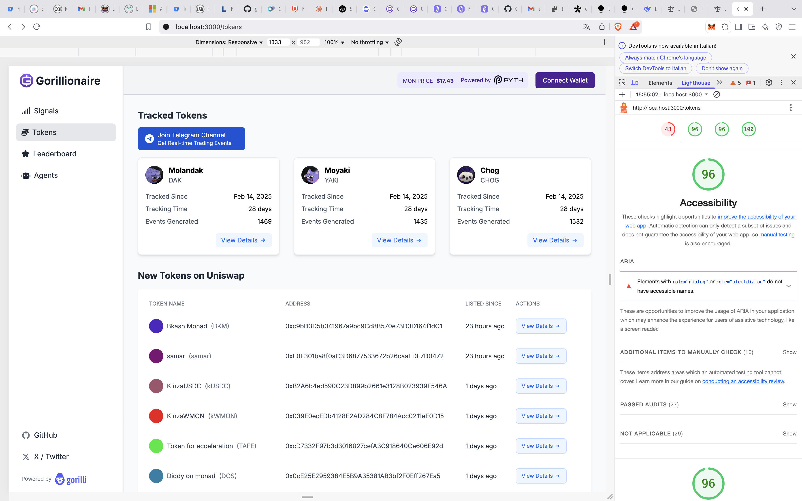

# Frontend

## Overview

We put strong emphasis on delivering an intuitive and accessible user experience with **Gorillionaire**, ensuring users of all backgrounds — from DeFi veterans to first-time traders — can navigate and use the platform effortlessly. The interface is clean, consistent, and easy to navigate. We followed UX best practices to ensure users can quickly understand where to go and what to do, with a clear and logical structure across all screens. Every interaction in **Gorillionaire** is designed to be simple and accessible, even for users unfamiliar with crypto trading or blockchain technologies. Features are easy to find, actions are straightforward, and the overall flow is smooth and frictionless.
We believe that a great user experience is key to onboarding more people into decentralized finance. By focusing on design, accessibility, and responsiveness, **Gorillionaire** offers a seamless and inclusive experience that leverages the performance power of **Monad**.
The UI has a modern and engaging visual design — with a harmonious color palette, smooth transitions, and thoughtfully crafted components. The platform is not only functional but also aesthetically pleasing, making it enjoyable to use.

## How to run the project locally

1- Install the dependencies
```
cd frontend
yarn
```

2- Clone the .env.example and add all the variables listed
```
mv .env.example .env
```


3- Run the development server:

```bash
yarn dev
```

4- Open: [http://localhost:3000](http://localhost:3000) with your browser to see the result.


### ✅ Accessibility  
We’ve paid attention to accessibility standards to make **Gorillionaire** inclusive for everyone:
- High-contrast color schemes for better visibility and readability.
- Clear visual hierarchy and semantic structure.
- Keyboard navigation and screen reader compatibility for users with motor or visual impairments.




### ✅ Responsive Design  
**Gorillionaire** is fully responsive and optimized for mobile devices. The layout adapts perfectly across different screen sizes, ensuring a seamless experience on both desktop and smartphones.

<p align="center">
   
  
</p>