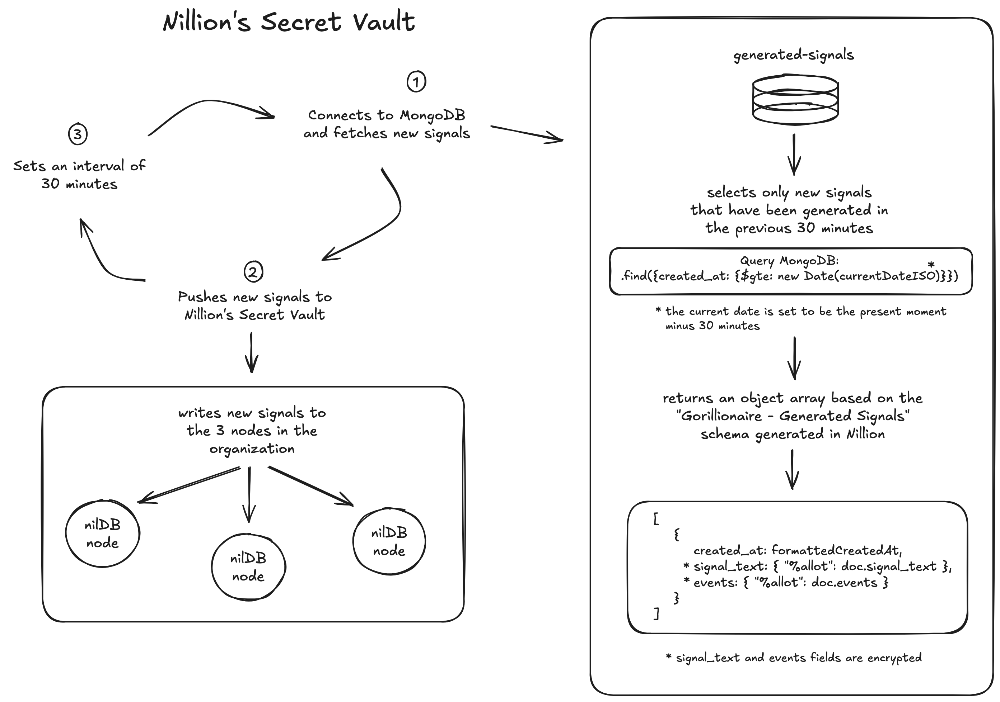

# Nillion's Secret Vault

## Overview
Nillion's Secret Vault allows developers and app creators to securely store sensitive information in an encrypted database distributed between various nodes.

We used Nillion to store the newly generated signals from Langchain's agent, encrypting both the signal text and the events that generated the signal. We decided to leave the "created_at" field in plain text as it is not a sensitive information.

## How to run the project locally

1- Install the dependencies
```
cd nillion
npm install
```

2- Clone the .env.example and add all the variables listed
```
mv .env.example .env
```

Register your organization at the following link:<br>
https://sv-sda-registration.replit.app/

This will allow you to obtain the Organization DID, along with the secret key.

3- Run the index.js script
```
node index.js
```

## Integration logic
**1- Connects to MongoDB and fetches newly created signals**<br>
The fetching process is set up as to retrieve only the signals generated in the previous 30 minutes. Since the signal agent generates a signal every hour, this ensures that we fetch only the newest signal, avoiding double signals stored in Nillion's Secret Vault.<br>

The raw signal is then formatted according to the "Gorillionaire - Generated Signals" schema created with Nillion.

**2- Pushes new signals to Nillion's Secret Vault**<br>
The formatted signal is uploaded on the three nilDB nodes, which will each store a fragment of the encrypted data.

**3- Set an interval of 30 minutes**<br>
This operation is looped every 30 minutes, ensuring the Nillion's Secret Vault is always up to date with the newly generated signals.




## Bounty application
This section of our projects applies for the Nillion's bounty at the following link:<br>
https://monad-foundation.notion.site/Sponsor-Bounties-Resources-1916367594f2802ba5d8c832089fde42?p=1916367594f280aea084c6cf78329696&pm=c
